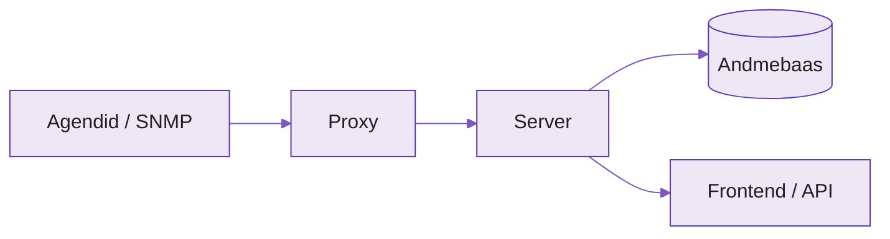
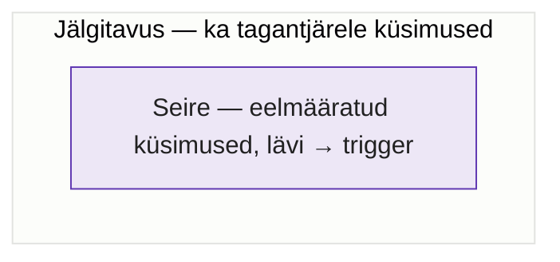
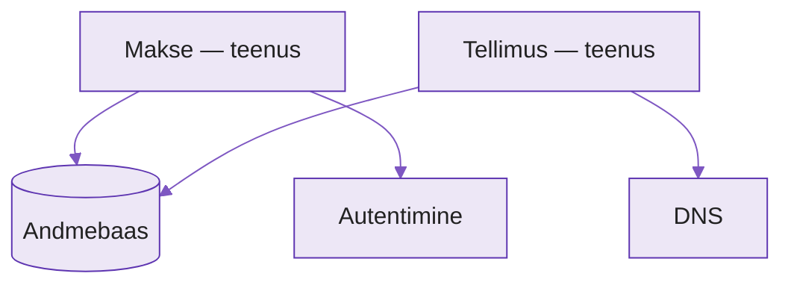
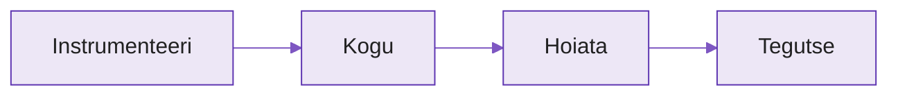

---
tags:
  - Monitooring
  - Jälgitavus
  - Zabbix
  - SRE
---

# Päev 1: Mõtteviis Zabbixi näitel

**Kursus:** IT-monitooring ja jälgitavus Zabbixi abil
**Kestus:** ~päev
**Tase:** Edasijõudnud — eeldame, et Zabbix on teil juba töös ja igapäevane

!!! abstract "Õpiväljundid"
    Pärast seda päeva oskad:

    - Eristada seiret ja jälgitavust ning selgitada, miks jälgitavus on seire ülemhulk
    - Kirjeldada kolme sammast ja näidata, kus need Zabbixis on ja kus veel pole
    - Eristada black-box ja white-box lähenemist
    - Valida nelja kuldsignaali abil, mida üldse monitoorida
    - Siduda SLI/SLO/veaeelarve Zabbixi SLA-raportiga
    - Hinnata häiret selle järgi, kas see paneb inimese tegutsema või toodab müra

---

## 1. Kaks päeva, kaks küsimust

Täna räägime **miks** — kuidas monitooringule ja jälgitavusele mõelda. Homme **kuidas** — kapoti alla ja Zabbixist väljapoole.

Te oskate Zabbixit juba; te ei tulnud õppima, kuidas hosti lisada. Täna lisame mõttemudeli, mille sees Zabbix on üks tugev tükk. Tööriista paigaldad päevaga, mõtteviisi muutmine võtab kuid — ja seesama mõtteviis eristab meeskonda, kes upub häiretesse, sellest, kes magab öösel.

---

## 2. Zabbix kui ühine sõnavara

Enne mõisteid paneme paika ühise kaardi, mille peale me kogu päeva ehitame.

<figure markdown="span">

  <figcaption>Joonis 2.1. Zabbixi andmevool: server on aju, andmebaas on ajalugu, proxy kogub eemalt, agent istub masinal (Talvik, 2026).</figcaption>
</figure>

Agent suhtleb serveriga kahel viisil:

=== "Passiivne"
    Server küsib, agent vastab. Sobib lähivõrku, kus server jõuab agendini.

=== "Aktiivne"
    Agent ühendub ise serveriga. Sobib tulemüüri või NAT-i taha, DMZ-sse.

Mõisted, mida kogu päeva kasutame:

| Mõiste | Tähendus |
|---|---|
| Host | jälgitav üksus — server, switch, teenus |
| Host group | grupeerib hoste õiguste ja mallide jaoks |
| Item | üks mõõdik (agent, SNMP, HTTP, arvutatud) |
| Trigger | tingimus itemi väärtusele |
| Action / media type | mis juhtub probleemi peale ja kuhu teade läheb |

*Tabel 2.1. Zabbixi põhimõisted*

Ülejäänu on tuttav: maintenance summutab probleemid hooldusaknal, template on korduvkasutatav itemite ja triggerite komplekt, LLD leiab kettad ja liidesed ise. Edasi vaatame, millise mõttemudeli sisse see kõik mahub.

---

## 3. Jälgitavus on mõtteviis, mitte tööriist

!!! example "Näidisstsenaarium"
    Teie Zabbixis on sadu hoste, kõik üleval, CPU ja mälu normis, triggerid korras. Siis helistab keegi: teenus on aeglane. Zabbix vastas täpselt sellele küsimusele, mille te talle ette seadsite — aga kasutaja küsimus oli teine.

See vahe ongi tänase päeva sisu. Seire jälgib **teadaolevaid** probleeme reeglite alusel; jälgitavus aitab tuvastada ka neid, mida sa ette ei näinud — "unknown-unknowns".

---

## 4. Seire vs jälgitavus

Seire on eelnevalt määratud küsimuste jälgimine: lävi → trigger. Jälgitavus lubab tagantjärele küsida ka seda, mida ette ei näinud. Ta ei ole seire vastand — ta on tema ülemhulk.

<figure markdown="span">

  <figcaption>Joonis 4.1. Seire on jälgitavuse sees, mitte tema kõrval (Talvik, 2026).</figcaption>
</figure>

Zabbixis on seire selgelt nähtav: trigger nagu `last(/host/system.cpu.util) > 5` on küsimus, mille sa **enne** püstitasid. Küsimust "miks see endpoint on aeglane ainult ühele kliendile teisipäeviti?" sa triggerina kirja ei pannud — sa ei teadnud, et vaja läheb. Jälgitavus on suutlikkus sellele tagantjärele vastata.

---

## 5. Kolm sammast: mõõdikud, logid, jäljed

Mõõdikud ütlevad **kui palju** (arv ajas), logid **mis täpselt juhtus** (detail), jäljed **kuhu aeg kulus** (päring läbi teenuste).

| Sammas | Olukord Zabbixis |
|---|---|
| Mõõdikud | Zabbixi kodu — itemid, mallid, SNMP |
| Logid | log-item teeb mustri-tuvastust, mitte täismahulist logihaldust |
| Jäljed | täna väljas; 8.0 LTS toob OpenTelemetri sisse |

*Tabel 5.1. Kolm sammast Zabbixi vaates*

---

## 6. Black-box vs white-box

=== "Black-box"
    Testib süsteemi **väljast**, nagu kasutaja: kas teenus vastab? Zabbixis: web scenario, simple check (ping, port), HTTP agent. Ütleb "katki".

=== "White-box"
    Mõõdab **seest**: CPU, järjekord, rakenduse mõõdikud. Zabbixis: agent item, SNMP, Agent 2 pluginad. Ütleb "miks".

Mõlemat on vaja. Ainult white-box jätab lõksu: kõik sisemine roheline, aga kasutaja ikka ligi ei pääse, sest probleem on vahepeal — DNS, load balancer, sertifikaat.

---

## 7. Mida monitoorida — neli kuldsignaali

Kui ei tea, kust alustada, alusta Google SRE neljast kuldsignaalist:[^sre]

| Signaal | Mida mõõdab | Zabbixis |
|---|---|---|
| Latentsus | kui kaua vastus võtab | web scenario vastusaeg |
| Liiklus | kui palju nõudlust | päringud/s item |
| Vead | kui suur osa ebaõnnestub | HTTP 5xx loendur / trigger |
| Küllastus | kui täis ressurss on | CPU, mälu, järjekord, ketas |

*Tabel 7.1. Neli kuldsignaali ja nende kodu Zabbixis*

---

## 8. Sildid, dimensioonid ja kardinaalsus

Silt on mõõtmik, mille järgi andmeid lõigata — teenus, keskkond, regioon. Idee on universaalne: Zabbix tags = Prometheus labels = OpenTelemetry attributes.

!!! warning "Kardinaalsuse lõks"
    Kõrge kardinaalsus — silt paljude erinevate väärtustega, nagu `user_id` või IP — plahvatab mõõdiku-andmebaasi, sest iga unikaalne väärtus loob uue aegrea. Kasuta siltides lõpliku hulgaga asju (keskkond, teenus, regioon); lõpmatu hulgaga asjad (kasutaja, sessioon, päringu ID) hoia logides ja jälgedes.

---

## 9. Teenusmõtlemine ja sõltuvused

Host on detail; teenus on lubadus kasutajale. Kasutaja ei hooli serverist number 17 — ta hoolib, kas makse toimib.

<figure markdown="span">

  <figcaption>Joonis 9.1. Jagatud sõltuvus (andmebaas) annab suurima plahvatusraadiuse (Talvik, 2026).</figcaption>
</figure>

Zabbixis on selleks business service monitoring: defineerid teenuse, seod ta olemasolevate triggeritega, ja Zabbix arvutab teenuse oleku ja SLA. Host → teenus annab teenuse-puu, sild CMDB poole.

---

## 10. SLI / SLO / veaeelarve

**SLI** on kasutajakogemuse mõõt (edukate päringute %, p99), mitte CPU. **SLO** on selle siht (nt 99,9% kuus). **Veaeelarve** on 1 − SLO.

Veaeelarve on kulutatav ressurss: kui seda on järel, võid riskida ja muudatusi teha; kui otsas, stabiliseerid. 100% on vale eesmärk — liiga kallis ja kasutaja ei märkagi.

!!! tip "Konkreetne number"
    99,9% kuus ≈ 43 minutit lubatud katkestust. Zabbixi SLA-raport arvutab kättesaadavuse, allajäämise ja kasutatud veaeelarve. Number otsustab, mitte valjeim hääl koosolekul.

---

## 11. Toil — korduv käsitsitöö

SRE-s on **toil** korduv, käsitsi tehtav, automatiseeritav töö ilma püsiva väärtuseta.[^toil] Tema halb omadus: ta skaleerub süsteemide arvuga. Suure halduskoormuse juures on toil suurim varjatud kulu.

Zabbixis on toili-kaotus sisse ehitatud: **mall** standardiseerib (üks muudatus → kõik hostid), **makro** lubab host-erandi ilma kloonimata, **LLD** leiab kettad ja liidesed ise. Standardiseerimine pluss automatiseerimine.

---

## 12. Häired: tegutsetav vs müra

Häire eesmärk on panna inimene tegutsema. Kui häire ei nõua tegevust, pole see häire — see kuulub dashboardile või logisse. Häireväsimus on tegelik oht: müra koolitab inimese eirama ka õiget signaali.

!!! tip "Test iga häire kohta"
    Kui see käivitub kell kolm öösel — mida inimene teeb? Kui vastus on "ei midagi" või "vaatab hommikul", pole see öine häire.

Zabbixis: hoiata sümptomitest, mitte põhjustest; trigger-sõltuvus annab andmebaasi kukkumisel ühe häire, mitte viiskümmend; eskalatsioon pageb öösel ainult kasutaja-mõju korral.

---

## 13. Tegutse-kiht — auto-remediation

Monitooring ei pea lõppema häirega — ta võib reageerida. Lihtsad korduvad juhud sobivad automaatseks lahendamiseks.

<figure markdown="span">

  <figcaption>Joonis 13.1. Monitooringu ahel ei lõpe häirega (Talvik, 2026).</figcaption>
</figure>

Zabbixis: trigger PROBLEM → action → remote command või skript. Teenus maas → restart; ketas täis → puhastus.

!!! warning "Ettevaatust"
    Logi alati, mida automaatika tegi, ja ära peida juurpõhjust. Vaikne taaskäivitus võib varjata probleemi, mis vajaks päris parandust. Hoia auto-remediation lihtsate, hästi mõistetud juhtude jaoks.

---

## 14. Kokkuvõte

- **Seire vastab teadaolevatele küsimustele; jälgitavus lubab esitada uusi.**
- **Kolm sammast:** Zabbix on tugev mõõdikutes; 8.0 toob jäljed sisse.
- **Mõõda kasutajakogemust, mitte ainult masinat** (SLI/SLO/veaeelarve).
- **Mõtle teenustes, mitte hostides** (business service monitoring).
- **Hoiata sümptomitest, mitte põhjustest** — üks häire, mitte viiskümmend.
- **Toil on suurim varjatud kulu** — mallid, makrod, LLD kaotavad teda.

Iga mõiste on seotud teie Zabbixiga. Homme viime need teostuseni.

---

## Enesekontroll

??? question "1. Mille poolest erineb seire jälgitavusest?"
    Seire jälgib eelnevalt määratud küsimusi (lävi → trigger). Jälgitavus lubab esitada ka neid küsimusi, mida ette ei näinud. Jälgitavus on seire ülemhulk, mitte vastand.

??? question "2. Miks ei tohi panna `user_id` mõõdikusildiks?"
    Kõrge kardinaalsus — iga unikaalne väärtus loob uue aegrea ja plahvatab mõõdiku-andmebaasi. Sellised dimensioonid kuuluvad logidesse ja jälgedesse.

??? question "3. Miks on 100% kättesaadavus vale eesmärk?"
    See on liiga kallis ja kasutaja ei märka vahet 99,9% ja 100% vahel. Veaeelarve (1 − SLO) on teadlik ruum riskimiseks ja muudatusteks.

??? question "4. Mis test eristab tegutsetava häire mürast?"
    Kui häire käivitub kell kolm öösel, kas inimene teeb midagi? Kui ei, pole see öine häire, vaid kuulub dashboardile või logisse.

---

## Allikad

### Ametlik dokumentatsioon
| Allikas | URL |
|---|---|
| Zabbix items | https://www.zabbix.com/documentation/current/en/manual/config/items/item |
| Zabbix triggers | https://www.zabbix.com/documentation/8.0/en/manual/config/triggers/trigger |
| Zabbix IT services (BSM) | https://www.zabbix.com/documentation/current/en/manual/it_services |
| Zabbix SLA report | https://www.zabbix.com/documentation/current/en/manual/it_services/sla |
| Trigger dependencies | https://www.zabbix.com/documentation/current/en/manual/config/triggers/dependencies |
| Low-level discovery | https://www.zabbix.com/documentation/current/en/manual/web_interface/frontend_sections/data_collection/hosts/discovery |

### Teooria ja kontekst
| Allikas | URL |
|---|---|
| IBM — observability vs monitoring | https://www.ibm.com/think/topics/observability-vs-monitoring |
| IBM — observability pillars | https://www.ibm.com/think/insights/observability-pillars |
| Zabbix tags — usage ja guidelines | https://blog.zabbix.com/tags-in-zabbix-6-0-lts-usage-subfilters-and-guidelines/19565/ |

[^sre]: Google SRE Workbook. https://sre.google/workbook/table-of-contents/
[^toil]: Eliminating Toil, Google SRE Book. https://sre.google/sre-book/eliminating-toil/

---

*Järgmine — Päev 2: Zabbixist jälgitavuseni (mõõdikud sügavuti, tracing, OpenTelemetry, arhitektuurid, full-stack, turve, automatiseerimine).*
