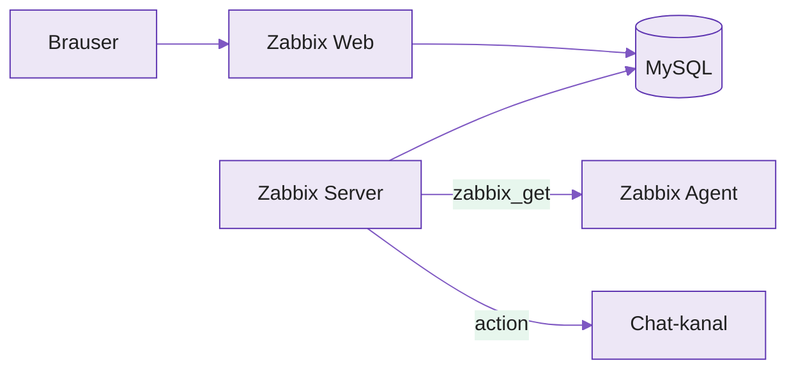

---
tags:
  - Praktikum
  - Zabbix
  - Monitooring
---

# Praktikum 1: Zabbix LLD ja triggeripõhised teavitused

Selles praktikumis püstitad Zabbixi Docker Compose'iga, lood sünteetilised mõõdikud ja lased madala taseme avastusel (LLD) need automaatselt leida. Seejärel kirjutad ühe trigger-prototüübi, mis paljuneb iga avastatud mõõdiku peale, ja saadad teavituse oma tiimi chat-kanalisse.

Praktikum kasutab **Zabbix 7.0 LTS** versiooni. See on sobiv valik õppetööks, sest 7.0 on pika toega haru ning kasutajaliides ja LLD-käitumine vastavad tänapäevasele Zabbixile. LLD näites kasutatakse JSON-i juurtasemel massiivi kujul; Zabbix toetab ka vana `{"data": [...]}` kuju, kuid uutes näidetes on juurtaseme massiiv eelistatud.

!!! abstract "Eesmärgid"
    Selle praktikumi läbimise järel:

    - Oskan püstitada Zabbix stacki (MySQL, server, web, agent) Docker Compose'iga
    - Oskan kirjutada skripti, mis genereerib LLD-le valiidset JSON-i
    - Oskan seadistada discovery reegli koos item- ja trigger-prototüüpidega
    - Oskan kirjutada künnis-triggeri (`>= 95`) prototüübina
    - Oskan ühendada chat-kanali ja seadistada action'i, mis saadab probleemi- ja recovery-teavitusi

!!! warning "Eeldused"
    Enne seda praktikumi pead oskama Dockerit ja Docker Compose'i, Linuxi käsurida ning SSH-d. Vaja on üldist arusaama monitooringust: mis on host, item ja trigger.

!!! info "Vaja läheb"
    - Ligipääs oma VM-ile SSH kaudu
    - Ligipääs ühele chat-kanalile, kuhu saad luua webhooki või bot'i
    - Soovitus: kasuta Discordi, sest see on selle praktikumi jaoks kõige lihtsam teavituste kanal

## Arhitektuur ja teenused

Zabbix ei ole monoliit nagu Prometheus. See koosneb mitmest osast: MySQL hoiab konfiguratsiooni ja ajalugu, server töötleb andmeid ja arvutab triggereid, web on kasutajaliides, agent kogub mõõdikuid. Action saadab teavituse välja chat-kanalisse.

<figure markdown="span">

  <figcaption>Joonis PN.1. Praktikumi Zabbix stack ja teavituste vool (Talvik, 2026).</figcaption>
</figure>

| Teenus | Image | Port | Roll |
|---|---|---|---|
| MySQL | `mysql:8.0.39` | sisemine | Konfiguratsioon ja ajalugu |
| Zabbix Server | `zabbix/zabbix-server-mysql:ubuntu-7.0-latest` | 10051 | Töötlemine, triggerid, action'id |
| Zabbix Web | `zabbix/zabbix-web-nginx-mysql:ubuntu-7.0-latest` | 8080 | Kasutajaliides |
| Zabbix Agent | `zabbix/zabbix-agent:ubuntu-7.0-latest` | 10050 | Mõõdikute kogumine |

*Tabel PN.1. Praktikumi teenused ja pordid*

!!! note "Versioonide valik"
    MySQL on siin pin'itud konkreetsele versioonile `8.0.39`, et vältida ootamatuid muutusi. Zabbixi puhul kasutatakse `7.0-latest` LTS-haru sees, et saada sama LTS-põlvkonna turva- ja veaparandused.

## Osa 1: Zabbix stack Dockeriga

### Samm 1: Kaust ja Compose-fail

**Loo töökaust kahe alamkaustaga** — `config` agendi UserParameter'ite jaoks ja `scripts` skripti jaoks:

```bash
mkdir -p ~/zabbix-lab/{config,scripts} && cd ~/zabbix-lab
```

Loo `docker-compose.yml`:

```yaml
services:
  mysql:
    image: mysql:8.0.39
    container_name: mysql
    environment:
      MYSQL_DATABASE: zabbix
      MYSQL_USER: zabbix
      MYSQL_PASSWORD: zabbix_pwd
      MYSQL_ROOT_PASSWORD: root_pwd
      TZ: Europe/Tallinn
    command:
      - mysqld
      - --character-set-server=utf8mb4
      - --collation-server=utf8mb4_bin
    volumes:
      - mysql-data:/var/lib/mysql
    healthcheck:
      test: ["CMD", "mysqladmin", "ping", "-uroot", "-proot_pwd"]
      interval: 10s
      timeout: 5s
      retries: 10
      start_period: 60s
    restart: unless-stopped

  zabbix-server:
    image: zabbix/zabbix-server-mysql:ubuntu-7.0-latest
    container_name: zabbix-server
    depends_on:
      mysql:
        condition: service_healthy
    environment:
      DB_SERVER_HOST: mysql
      MYSQL_DATABASE: zabbix
      MYSQL_USER: zabbix
      MYSQL_PASSWORD: zabbix_pwd
      TZ: Europe/Tallinn
    ports:
      - "10051:10051"
    restart: unless-stopped

  zabbix-web:
    image: zabbix/zabbix-web-nginx-mysql:ubuntu-7.0-latest
    container_name: zabbix-web
    depends_on:
      mysql:
        condition: service_healthy
      zabbix-server:
        condition: service_started
    environment:
      ZBX_SERVER_HOST: zabbix-server
      DB_SERVER_HOST: mysql
      MYSQL_DATABASE: zabbix
      MYSQL_USER: zabbix
      MYSQL_PASSWORD: zabbix_pwd
      PHP_TZ: Europe/Tallinn
      TZ: Europe/Tallinn
    ports:
      - "8080:8080"
    restart: unless-stopped

  zabbix-agent:
    image: zabbix/zabbix-agent:ubuntu-7.0-latest
    container_name: zabbix-agent
    environment:
      ZBX_SERVER_HOST: zabbix-server
      ZBX_HOSTNAME: zabbix-agent
      TZ: Europe/Tallinn
    volumes:
      - ./config:/etc/zabbix/zabbix_agentd.d:ro
      - ./scripts:/opt/scripts:ro
    restart: unless-stopped

volumes:
  mysql-data:
```

Konteinerid viitavad teineteisele DNS-nimega, mitte IP-aadressiga (`DB_SERVER_HOST: mysql`). `ZBX_HOSTNAME` peab Zabbixi UI-s host'i nimega täpselt ühtima. Agent mountib `config` ja `scripts` kaustad; neid kasutad Osas 2.

### Samm 2: Käivita ja kontrolli

**Käivita kogu stack ja vaata teenuste olekut:**

```bash
docker compose up -d
docker compose ps
```

Oodatav tulemus: neli teenust on `Up`, MySQL on `(healthy)`. Esmakäivitus võib võtta umbes minuti, sest Zabbix server loob andmebaasi tabelid.

!!! warning "Levinud viga"
    Kui `zabbix-web` või `zabbix-server` restartub, ei pruugi MySQL veel valmis olla. Vaata `docker compose logs mysql` ja oota. Kui probleem jääb püsima, kontrolli `free -h`; väikese VM-i puhul võib RAM olla piiriks.

!!! tip "Kui stack ei käivitu — diagnoosi ise"
    Edasijõudnu ei tõsta kohe kätt, vaid loeb kõigepealt logi.

    1. **Logi** — `docker compose ps` näitab, milline teenus on `Restarting` või `Exited`. `docker compose logs <teenus>` näitab tegelikku veateadet, `docker compose logs -f <teenus>` jälgib reaalajas.
    2. **Dokumentatsioon** — otsi veateate võtmesõna Zabbixi manuaalist, image'i Docker Hub lehelt või Docker dokumentatsioonist.
    3. **AI** — kleebi konkreetne logirida koos kontekstiga: milline image, milline käsk, milline fail.

    Logi annab fakti; dokumentatsioon ja AI aitavad seda tõlgendada. Alusta alati logist.

### Samm 3: Login ja agent-host

Zabbix web töötab VM-il pordil 8080. Kui su brauser ei jookse VM-il endal, suuna port SSH kaudu oma masinasse:

```bash
ssh -L 8080:localhost:8080 <kasutaja>@<sinu-VM>
```

Seejärel ava UI aadressilt:

```text
http://localhost:8080
```

**Logi sisse ja vaheta parool:**

1. Ava brauseris `http://localhost:8080`
2. Login: `Admin` / `zabbix`
3. Ikoon üleval paremas → **Users → Admin → Change password** → `Monitor2026!`

**Lisa agent host:**

*Data collection → Hosts → Create host*:

1. Host name: `zabbix-agent`
2. Host groups: `Linux servers`
3. Interfaces → Add → **Agent** → DNS name `zabbix-agent`, Connect to **DNS**, port `10050`
4. Add

Kontrolli, et server jõuab agendini:

```bash
docker exec zabbix-server zabbix_get -s zabbix-agent -k agent.ping
```

Oodatav tulemus:

```text
1
```

!!! warning "Levinud viga"
    Kui ZBX-indikaator jääb punaseks, peab Host name olema täpselt `zabbix-agent` ehk sama mis `ZBX_HOSTNAME`. Interface peab kasutama DNS-nime `zabbix-agent`, mitte juhuslikku IP-aadressi.

## Osa 2: Sünteetilised mõõdikud

Päris LLD avastab asju, mille arvu sa ette ei tea: kettaid, võrguliideseid, konteinereid, andureid või teenuseid. Siin fakeerime mõõdikud, et isoleerida LLD, trigger ja teavitus reaalsete logide mürast. Kujuta kolme teenust (`metric1`, `metric2`, `metric3`), millest igaüks raporteerib väärtuse 0–100.

### Samm 1: Discovery- ja väärtuse-skript

Üks skript täidab kaks rolli: argumendiga `discovery` tagastab JSON-i, mida LLD ootab; muu argumendiga tagastab selle mõõdiku väärtuse.

```bash
cat > ~/zabbix-lab/scripts/lab-metrics.sh <<'EOF'
#!/bin/bash
# Sünteetilised mõõdikud LLD demo jaoks
case "$1" in
  discovery)
    echo '[{"{#METRIC}":"metric1"},{"{#METRIC}":"metric2"},{"{#METRIC}":"metric3"}]'
    ;;
  *)
    if [ -f "/tmp/lab-spike-$1" ]; then
      echo 99
    else
      echo $(( RANDOM % 101 ))
    fi
    ;;
esac
EOF
chmod +x ~/zabbix-lab/scripts/lab-metrics.sh
```

Spike-haru (`/tmp/lab-spike-<metric>`) lubab Osas 4 ühe mõõdiku väärtuse üle 95 sundida, et triggerit testida ilma juhust ootamata.

Kontrolli, et fail on hosti poolel käivitatav:

```bash
ls -l ~/zabbix-lab/scripts/lab-metrics.sh
```

Faili õigustes peab olema `x`, näiteks `-rwxr-xr-x`.

### Samm 2: UserParameter'id

**Lisa agendile kaks võtit** — üks avastuseks ja üks väärtuse jaoks:

```bash
cat > ~/zabbix-lab/config/lab-metrics.conf <<'EOF'
UserParameter=lab.discovery,/opt/scripts/lab-metrics.sh discovery
UserParameter=lab.metric[*],/opt/scripts/lab-metrics.sh $1
EOF

docker restart zabbix-agent
sleep 5
```

Kontrolli ka konteineri seest, et skript on nähtav ja käivitatav:

```bash
docker exec zabbix-agent ls -l /opt/scripts/lab-metrics.sh
```

Testi serverist mõlemat võtit:

```bash
docker exec zabbix-server zabbix_get -s zabbix-agent -k lab.discovery
docker exec zabbix-server zabbix_get -s zabbix-agent -k "lab.metric[metric1]"
```

Oodatav tulemus: esimene käsk tagastab JSON-massiivi, teine numbri 0–100.

Näide korrektsest discovery-väljundist:

```json
[{"{#METRIC}":"metric1"},{"{#METRIC}":"metric2"},{"{#METRIC}":"metric3"}]
```

!!! note "Miks mitte `data` wrapper?"
    Vanades Zabbixi näidetes näed sageli kuju `{"data": [...]}`. Tänapäevases Zabbixis on eelistatud JSON-massiiv otse juurtasemel. Zabbix aktsepteerib vana kuju tagasiühilduvuse pärast, kuid uue labori jaoks on juurtaseme massiiv selgem.

!!! warning "Levinud viga"
    `ZBX_NOTSUPPORTED` tähendab tavaliselt, et skript ei ole täidetav või `UserParameter` süntaks on vigane. Kontrolli:

    ```bash
    docker exec zabbix-agent ls -l /opt/scripts/lab-metrics.sh
    cat ~/zabbix-lab/config/lab-metrics.conf
    docker restart zabbix-agent
    ```

## Osa 3: LLD — discovery ja item-prototüüp

Discovery rule käivitab `lab.discovery` võtme, saab listi `{#METRIC}` väärtustest ja loob iga väärtuse jaoks item'i ühe prototüübi põhjal. Sina kirjutad ühe mustri, Zabbix teeb N item'it. Kui hiljem lisandub `metric4`, tekib uus item automaatselt.

### Samm 1: Discovery rule

*Data collection → Hosts → `zabbix-agent` real **Discovery** → Create discovery rule*:

1. Name: `Lab metrics discovery`
2. Type: **Zabbix agent**
3. Key: `lab.discovery`
4. Update interval: `1m`
5. Add

!!! warning "Levinud viga"
    Kui discovery rule annab JSON-vea, testi väljund uuesti:

    ```bash
    docker exec zabbix-server zabbix_get -s zabbix-agent -k lab.discovery
    ```

    Väljund peab olema korrektne JSON. Selle praktikumi puhul peab see olema juurtaseme massiiv, kus igas objektis on `{#METRIC}` makro.

### Samm 2: Item-prototüüp

`Lab metrics discovery` real **Item prototypes → Create item prototype**:

1. Name: `Metric {#METRIC}`
2. Type: **Zabbix agent**
3. Key: `lab.metric[{#METRIC}]`
4. Type of information: **Numeric (unsigned)**
5. Update interval: `30s`
6. Add

Oota umbes 1–2 minutit: discovery interval + esimene kogumine. Seejärel ava *Monitoring → Latest data*, vali host `zabbix-agent` ja kontrolli, et näed kolme item'it. Väärtus muutub iga 30 sekundi järel.

!!! tip "Kontrollpunkt enne triggerit"
    Ära liigu trigger-prototüübi juurde enne, kui `Latest data` vaates on olemas:

    - `Metric metric1`
    - `Metric metric2`
    - `Metric metric3`

    Kui item'eid pole, on probleem discovery rule'is või item-prototüübis, mitte triggeris.

## Osa 4: Trigger-prototüüp (`>= 95`)

Sama loogika kehtib triggeritele: üks prototüüp `{#METRIC}` makroga, Zabbix teeb iga avastatud mõõdiku peale eraldi triggeri.

### Samm 1: Prototüüp

`Lab metrics discovery` real **Trigger prototypes → Create trigger prototype**:

1. Name: `Metric {#METRIC} kriitiline (>=95) {HOST.NAME}`
2. Severity: **High**
3. Expression:

```text
last(/zabbix-agent/lab.metric[{#METRIC}])>=95
```

Kontroll: *Data collection → Hosts → zabbix-agent → Triggers*. Seal peaksid nägema kolme triggerit, üks iga mõõdiku kohta.

!!! warning "Levinud viga"
    Kui tuleb viga stiilis "must contain at least one item prototype", kasutab expression tõenäoliselt konkreetset item'it, näiteks `lab.metric[metric1]`. Trigger-prototüüp peab kasutama makrot `{#METRIC}`, sest prototüüp peab seostuma item-prototüübiga.

### Samm 2: Käivita trigger spike-failiga

Väärtused on juhuslikud, nii et mõni ületab 95 varem või hiljem ise. Et mitte oodata, kasuta Osas 2 valmistatud spike-faili:

```bash
docker exec zabbix-agent touch /tmp/lab-spike-metric1
```

Umbes 30–60 sekundi pärast ava *Monitoring → Problems*. Seal peaks ilmuma `Metric metric1 kriitiline (>=95)` severityga **High**.

Lahenda probleem:

```bash
docker exec zabbix-agent rm /tmp/lab-spike-metric1
```

Järgmise kogumise järel langeb väärtus tõenäoliselt alla 95 ja trigger laheneb ise olekusse **Resolved**.

!!! tip "Edasijõudnule: hüsterees"
    Praegu läheb trigger probleemiks väärtusel `>=95` ja taastub kohe, kui väärtus langeb alla 95. Kuna väärtus on juhuslik, võib see piiri ümber võbelda. Lisa trigger-prototüübile eraldi **Recovery expression**:

    - Problem expression: `last(/zabbix-agent/lab.metric[{#METRIC}])>=95`
    - Recovery expression: `last(/zabbix-agent/lab.metric[{#METRIC}])<90`

    Vahemik 90–95 tähendab: ära taasta veel, vaid oota stabiilsemat paranemist.

## Osa 5: Teavitused chat-kanalisse

Problems-leht on kasulik ainult siis, kui keegi seda vaatab. Kell 03:00 ei vaata keegi. Seetõttu saadame teavituse sinna, kus tiim niikuinii töötab. Ahel koosneb kolmest osast: **media type** ehk kuidas saata, **user media** ehk kellele saata, ja **action** ehk millal saata.

### Samm 1: Vali kanal ja hangi sihtpunkt

| Kanal | Zabbixi seadistus | Soovitus praktikumi jaoks |
|---|---|---|
| Discord | Sisseehitatud media type, parameetriks webhook URL | Kõige lihtsam |
| Slack | Sisseehitatud media type, vajab bot-tokenit ja kanalit | Sobib, aga nõuab rohkem seadistust |
| MS Teams | Kasuta Workflows-põhist webhooki; vanad Office 365 connectorid on pensionile viidud | Kasuta ainult siis, kui koolitaja seda nõuab |

**Hangi sihtpunkt vastavalt kanalile:**

- **Discord:** kanali Settings → Integrations → Webhooks → New Webhook → Copy Webhook URL
- **Slack:** loo Slack app → Bot Token (`xoxb-...`) õigusega `chat:write` → kutsu bot kanalisse
- **MS Teams:** kanal → ⋯ → Workflows → *Post to a channel when a webhook request is received* → kopeeri URL[^teams]

!!! tip "Praktikumi soovitus"
    Kui sul pole põhjust kasutada Slacki või Teamsi, vali Discord. Nii jääb fookus Zabbixi LLD-le ja triggeritele, mitte chat-platvormi õigustele.

### Samm 2: Media type

*Alerts → Media types* → leia oma kanal (Discord / Slack / MS Teams) → ava → sisesta vajalik parameeter:

- Discord: webhook URL
- Slack: bot-token ja kanal
- Teams: Workflows webhook URL

Veendu, et media type on **Enabled**.

Testi kohe: media type rea lõpus **Test** → täida väljad → **Test**. Sõnum peab kanalisse jõudma.

!!! warning "Levinud viga"
    Kui Test annab `Connection timeout`, ei jõua `zabbix-server` konteiner internetti või ei pääse ta selle teenuse aadressile ligi. See on võrgu- või tulemüüriprobleem, mitte LLD ega triggeri probleem.

### Samm 3: User media

*Users → Users → Admin → Media → Add*:

1. Type: su kanal
2. Send to: chat-kanal või sihtpunkt, mida media type nõuab
3. Enabled
4. Update, seejärel salvesta kasutaja

### Samm 4: Action

*Alerts → Actions → Trigger actions → Create action*:

1. **Action** tab: Name `Lab metrics teavitused`
2. Conditions → Add → *Trigger severity* `>=` `High`
3. **Operations** tab: Add → *Send to users* `Admin` → *Send only to* `<su kanal>`
4. **Recovery operations** tab: Add → sama kasutaja ja sama kanal
5. Veendu, et action on **Enabled**
6. Add

### Samm 5: Test otsast otsani

**Sunni trigger uuesti ja jälgi kanalit:**

```bash
docker exec zabbix-agent touch /tmp/lab-spike-metric1
```

Umbes minuti jooksul peaks kanalisse tulema probleemiteavitus.

Lahenda probleem:

```bash
docker exec zabbix-agent rm /tmp/lab-spike-metric1
```

Seejärel peaks tulema recovery-sõnum.

!!! warning "Levinud viga"
    Kui trigger läks Firing, aga sõnumit ei tulnud, vaata *Reports → Action log*. Kõige sagedasem põhjus on `no media defined` ehk User media on puudu, või action'i tingimus ei sobinud sündmusega.

---

## Tõrkeotsing

| Probleem | Põhjus | Lahendus |
|---|---|---|
| `zabbix-web` restartub | MySQL pole veel healthy või DB ei ole valmis | `docker compose logs mysql`, oota; kontrolli `free -h` |
| ZBX host punane | Host name ei ühti `ZBX_HOSTNAME` väärtusega või interface on vale | Host name = `zabbix-agent`, Connect to = **DNS** |
| `ZBX_NOTSUPPORTED` | Skript ei täideta või `UserParameter` on vigane | `docker exec zabbix-agent ls -l /opt/scripts/lab-metrics.sh`, `cat config/lab-metrics.conf`, `docker restart zabbix-agent` |
| Discovery rule annab JSON-vea | Discovery võti ei tagasta korrektset JSON-i | `docker exec zabbix-server zabbix_get -s zabbix-agent -k lab.discovery` |
| Item'eid ei teki | Discovery interval pole veel möödunud või item-prototüüp on vale | Oota 1m + kogumine; kontrolli `Latest data` vaadet |
| Trigger-prototüübi viga | Expression kasutab konkreetset nime | Kasuta makrot `{#METRIC}` |
| Trigger ei lähe Firing | Väärtus pole `>=95` | `docker exec zabbix-agent touch /tmp/lab-spike-metric1` |
| Trigger võbeleb Firing/Resolved vahel | Puudub hüsterees | Lisa recovery expression `<90` |
| Media type Test timeout | VM-il või konteineril pole egressi chat-teenuse suunas | Võrgu või tulemüüri probleem — teavita koolitajat |
| Trigger Firing, sõnumit ei tule | User media puudu või action'i condition ei sobinud | Vaata *Reports → Action log* |

*Tabel PN.2. Levinumad probleemid ja lahendused*

---

## Kokkuvõte

Selles praktikumis sa:

- Püstitasid Zabbix stacki (MySQL, server, web, agent) Docker Compose'iga
- Kirjutasid skripti, mis genereerib LLD-le valiidset JSON-i ja sünteetilisi väärtusi
- Seadistasid discovery reegli, mille item-prototüüp lõi kolm item'it automaatselt
- Kirjutasid künnis-trigger-prototüübi (`>=95`), mis paljunes iga avastatud mõõdiku peale
- Ühendasid chat-kanali ja seadistasid action'i, mis saatis probleemi- ja recovery-teavitused

---

## Enesekontroll

??? question "1. Miks on LLD parem kui item'ite käsitsi loomine?"
    Kui avastatavate objektide arv on muutuv või ette teadmata, näiteks kettad, liidesed, konteinerid või teenused, kirjutad LLD-ga ühe prototüübi ja Zabbix loob kõik item'id ise. Uue objekti tekkimisel lisandub item automaatselt; käsitsi peaksid iga kord uue lisama.

??? question "2. Mis on discovery rule, item-prototüübi ja trigger-prototüübi vahe?"
    Discovery rule käivitab võtme, mis tagastab listi `{#MAKRO}` väärtustest. Item-prototüüp on item'i muster `{#MAKRO}` makroga, mille põhjal luuakse iga avastatud väärtuse jaoks item. Trigger-prototüüp on triggeri muster, mille põhjal luuakse iga avastatud item'i jaoks trigger.

??? question "3. Miks peab trigger-prototüübi expression kasutama `{#METRIC}` makrot?"
    Prototüüp peab viitama item-prototüübile, mitte ühele konkreetsele item'ile. Makro `{#METRIC}` seob triggeri avastatud item'iga; ilma selleta ei tea Zabbix, millise N item'i jaoks triggereid luua.

??? question "4. Mis juhtub, kui spike-fail eemaldatakse?"
    Väärtuse-skript läheb tagasi juhusliku väärtuse režiimi. Järgmisel kogumisel langeb väärtus tõenäoliselt alla 95, trigger-tingimus ei kehti enam ja trigger laheneb olekusse **Resolved**. Kui recovery operation on seadistatud, saadetakse recovery-teavitus.

??? question "5. Mis kolm osa peavad teavituste ahelas paigas olema?"
    Media type ehk kuidas saata, user media ehk kellele saata, ja action ehk millal saata. Kui üks neist puudub, sõnumit ei tule. Põhjuse näitab *Reports → Action log*.

## Iseseisva töö põhjendus (esitamiseks)

Lisa praktikumi juurde lühike kirjalik põhjendus — paar lauset iga punkti kohta. See osa tõendab õpiväljundeid, mida pelk seadistamine ei näita.

1. **Seire vs jälgitavus.** Mida see seadistus seirab ja kus jääb pelgast seirest väheks — kus tuleksid appi mõõdikud, logid, jäljed? (ÕV1)
2. **Teenusepõhine vaade.** Kui see mõõdik oleks osa mingist teenusest, kuidas seostaksid selle SLI, SLO ja veaeelarvega? (ÕV2)
3. **Teavitamise loogika.** Põhjenda triggeri, hüstereesi ja action'i valikuid: miks need läved, miks recovery `<90`, kuidas väldid valehäireid ja müra, näiteks sõltuvuste ja eskaleerimisega? (ÕV3)
4. **Laiendus ja automatiseerimine.** Kuidas saaks seda lahendust laiendada või automatiseerida OpenTelemetry, Zabbix API või Ansible abil? (ÕV5)

[^teams]: Microsoft soovitab Office 365 connectorite asemel kasutada Teamsis Workflows-põhiseid webhooke. Vanad connectorid on järk-järgult kasutusest eemaldatud, mistõttu on uute praktikumi juhiste jaoks Workflows kindlam valik.
